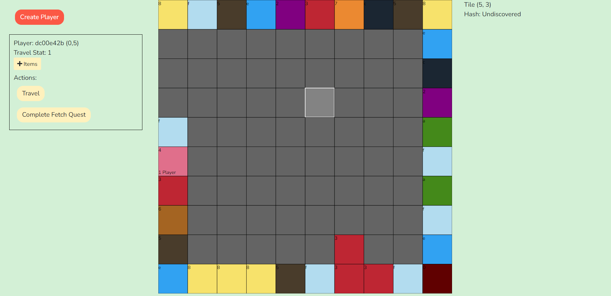

# Grid Game

## About

Grid Game is an experimental project that aims to be a persistent, procedural, grid-based, 100% on-chain MMO that can evolve over time.

This project is built with NodeJS.
It uses Hardhat, Truffle, and Ganache for smart contract development.
Vue and Ethers are used on the front-end.
There's no "server" as it's intended to be 100% on-chain.
As such, Metamask is required for all users.

## How to run the app locally

I'm assuming you're a developer who knows how to use NPM.

NOTE: I made the mistake of using node-sass.
Apparently, you must use npm 14 otherwise node-sass will blow up.
And, if your versions get messed up, it's a real PITA to fix.

1. Compile the smart contracts with `npm run compile`
2. Build a deployment package with `npm run deploy-package`  
   This builds two files: deployment.zip and abiRef.js in /solidity/artifacts.
   These files are for streamlining contract deployment, and updating contract ABIs on the front-end, respectively.
3. You may need to copy the abiRef.js and replace the file in /web/src/ref, if they are different.
4. Run Ganache (you may use Ethereum defaults)  
   Alternatively, you may use a test network like Ropsten, but this requires more setup.
5. Run the front-end with `npm run serve`
6. Navigate to: http://localhost:8080/#/admin/deploy-smart-contract
7. Ensure that Metamask is connected, and your local Ganache instance is selected. In Ganache, copy the private key of the first wallet and add it to Metamask. Give it a name like "TEST ONLY" and don't use it for real money.
8. In the deployment package file chooser, select the deployment.zip file and click "Read File".
9. Deploy and Register each contract one-by-one.  
   (I'd really like to fully automate this process, but I'm not sure how to do this without a lot more development effort. Plus, I like the UI as it allows me to manually fix problems as they arise. And it gives me the flexibility to upgrade certain contracts without re-deploying the whole lot.)
10. Copy the ApplicationRegistry address. Open /web/src/store/index.js and paste the address for the variable APP_REG_ADDRESS.  
    (I'd like to find a better home for this variable)
11. Navigate to http://localhost:8080/#/ and create a Player. Now you can travel to different grid squares and reveal them, mint lootboxes and quest items, etc.

## Extending the game

The game can be extended by creating additional contracts and registering their access in the ApplicationRegistry.
This will enable your contracts to access the inner game framework.
It's also possible to update certain core components by re-deploying and re-registering them.
However, any contracts that contain game state variables should never be redeployed, unless a migration strategy is in place.
There are still many architectural improvements that can be made to alleviate some of these problems.
For example, using single-function interfaces is great for interoperability.
Using addresses instead of contract-type variables is good too.
Also keeping all game logic away from ERC contracts for better future-proofing.
I've started implementing some of these concepts into the code, but more work is required.

## Exploiting on-chain RNG

Yes, it's technically possible to exploit the RNG due to it being deterministic.
My intent is to design the gameplay in such a way that exploitation is difficult, requires multiple transactions, and has limited payoff.
In the current state, it's not quite there yet.

All actions require a Player. Each player has its own stream of random numbers.
If every player action changes the state of its stream, then it could take several transactions before getting a favorable result.
So, you're probably better off just doing the action repeatedly until you get what you want.
And a well-designed bot would still have an advantage over other players - which is good!
In theory...

## Credits

Big thanks to @AbysmalParadox for item graphics!

I've copied some smart contract code from various places.
I'll try to keep track of it here:

https://github.com/ProjectOpenSea/opensea-creatures
